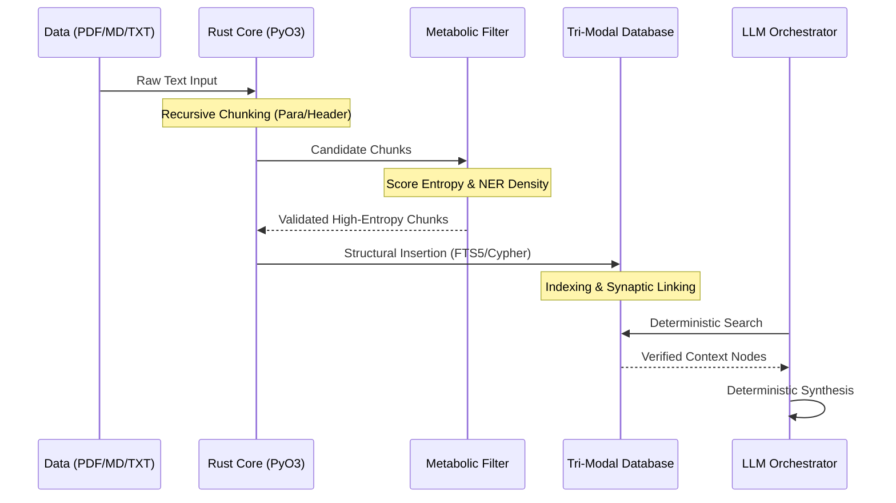
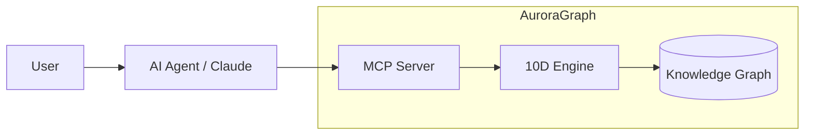

# AuroraGraph 10D: Deep Architecture 🧠

This document outlines the internal mechanics of the AuroraGraph 10D engine, focusing on the ingestion pipeline, the Tri-Modal graph strategy, and the Rust-powered core.

---

## 🏎️ The Ingestion Pipeline (10D Synoptic Flow)

AuroraGraph doesn't just "store" text; it filters and structures it for deterministic reasoning.

### 1. The Rust "Bare-Metal" Layer
The core text processing logic (chunking and metabolic validation) is implemented in **Rust** using the **PyO3** library. 
- **Why?** Python's Global Interpreter Lock (GIL) and high-level string handling create bottlenecks when processing thousands of documents. Rust provides $O(n)$ linear-time parsing at the memory level.
- **Key Function**: `auragraph_core.chunk_text` and `auragraph_core.is_valid_text`.

### 2. Metabolic Filtering
The "Energy" of a node is determined by its Shannon Entropy and Named Entity (NER) density. 
- **Fluff Nodes**: "Copyright 2024. All rights reserved." -> Low entropy, 0 NER -> **Discarded**.
- **Synaptic Nodes**: "The Q3 EBITDA increased by 14% due to the SAP migration." -> High entropy, 3 NER -> **Preserved**.

---

## 🕸️ Tri-Modal Database Strategy

AuroraGraph is database-agnostic through its `BaseGraphDB` interface.

| Mode | Database | Target Use Case |
| :--- | :--- | :--- |
| **Simple** | SQLite (FTS5) | Development, Local Research, Zero-Latency Keyword Recall. |
| **Embedded Graph** | Kùzu | Local High-Performance Graph Analytics (Disk-based). |
| **Enterprise** | Neo4j | Multi-user clusters, Large-scale relationship visualization. |

---

## 🤖 MCP Interconnect

AuroraGraph acts as a **Model Context Protocol (MCP)** server. This allows agents (like Claude Desktop) to call AuroraGraph tools directly via JSON-RPC.

### Key Tools exposed via MCP:
- `auragraph_query`: Execute a deterministic 10D search.
- `auragraph_parallel_query`: Expand queries into multiple sub-nodes for exhaustive retrieval.

---

## 📊 Observability (Prometheus Stack)

The system exposes metrics on port `:8000/metrics`.
- `auragraph_queries_total`: Counter for request volume.
- `auragraph_retrieval_seconds`: Histogram of database latency.
- `auragraph_generation_seconds`: Histogram of LLM response time.

Deployment includes a pre-configured **Grafana Dashboard** to visualize these metrics in real-time.
