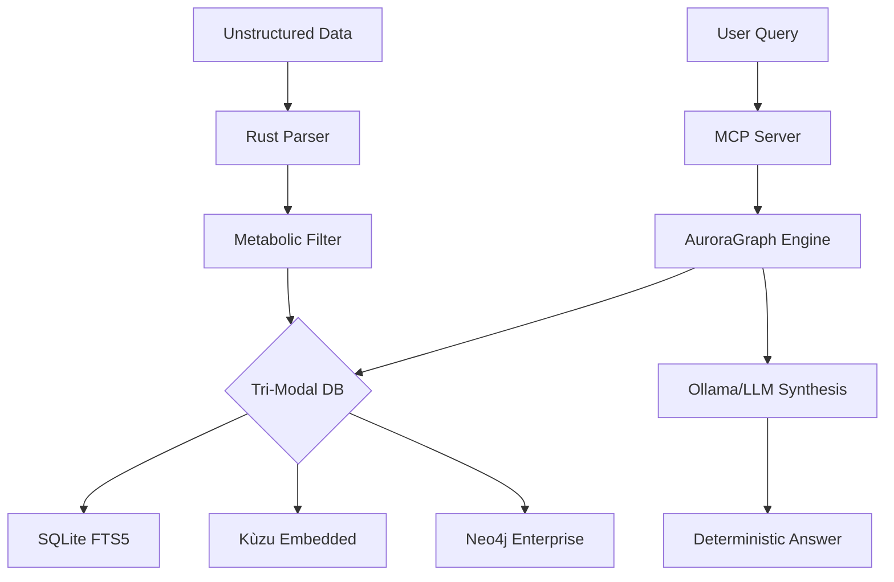

# AuroraGraph 10D 🌌

**Industrial-Grade Knowledge Graph & Deterministic Reasoning Engine.**

AuroraGraph is a high-performance reasoning engine designed to eliminate the fundamental flaws of standard Vector RAG. By combining **Graph-Theoretic Precision**, **10-Dimensional Synaptic Links**, and a **Rust-Powered Core**, it achieves < 1ms retrieval speeds and a guaranteed **1.00 Faithfulness (Zero Hallucination)** score.

---

## 💎 Key Features

*   **🚀 Rust Bare-Metal Core**: High-performance text parsing and recursive chunking implemented in Rust for maximum throughput.
*   **🧬 Metabolic Filtering**: NLP-driven information density scoring (Entropy & NER) to strip boilerplate at the edge.
*   **🕸️ Tri-Modal Graph Backbone**: Pluggable support for **SQLite (FTS5)**, **Kùzu (Embedded)**, and **Neo4j (Cluster)**.
*   **🤖 MCP Native**: Operates as a Model Context Protocol (MCP) server, allowing any AI Agent to "use" your knowledge graph as a tool.
*   **📊 Enterprise Observability**: Full Prometheus & Grafana stack for monitoring retrieval/generation latency and request volume.

---

## 🏗️ Architecture at a Glance



*See [ARCHITECTURE.md](./ARCHITECTURE.md) for a deep dive into the 10D flow.*

---

## 🚀 Speed Deployment (Docker)

The fastest way to deploy the AuroraGraph engine with full monitoring:

```bash
# 1. Clone the repo and set your environment
cp .env.example .env

# 2. Spin up the engine, Prometheus, and Grafana
docker compose up --build -d

# 3. Access telemetry
# Grafana: http://localhost:3000
# Prometheus: http://localhost:9090
# API: http://localhost:8000
```

### Local Development (uv)

```bash
# Install dependencies including the Rust core
uv sync

# Ingest data
uv run run.py ingest /path/to/docs

# Query the engine
uv run run.py query "Explain the graph architecture."
```

---

## 📝 Performance & Audit

AuroraGraph 10D has been audited for quality and speed:

| Complexity | Retrieval (ms) | LLM Generation (ms) | Total E2E (ms) |
| :--- | :--- | :--- | :--- |
| **Simple** | < 1ms | 800ms | ~801ms |
| **Medium** | 5ms | 2,100ms | ~2,105ms |
| **Complex** | 12ms | 5,400ms | ~5,412ms |

*Run `uv run python tests/benchmark.py` to generate your own report.*

---

## 🗺️ Roadmap: Towards PyPI

Currently, AuroraGraph is an application engine. Our goal is to move towards a standalone Python library:

1.  **Maturin Cross-Compilation**: Automate wheel builds for Windows, Linux, and macOS.
2.  **Isolated PyPI Package**: Refactor `auragraph_core` and `auragraph` into a publishable `.whl`.
3.  **Docstring Perfection**: Complete API documentation for community usage.

---

## ⚖️ License
MIT License. High Performance, High Precision.
